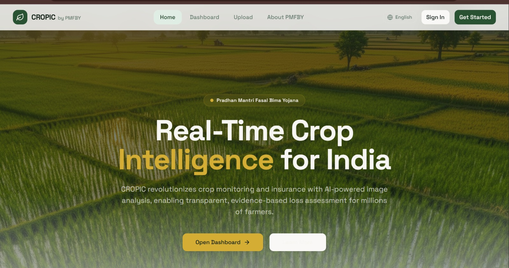
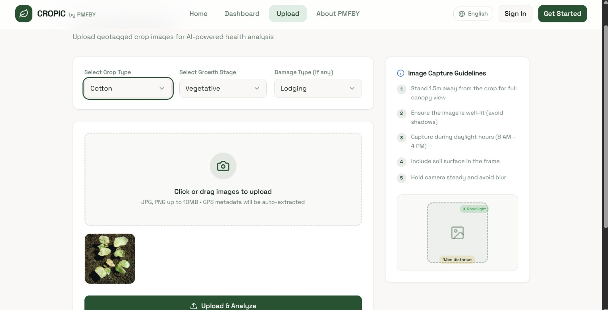
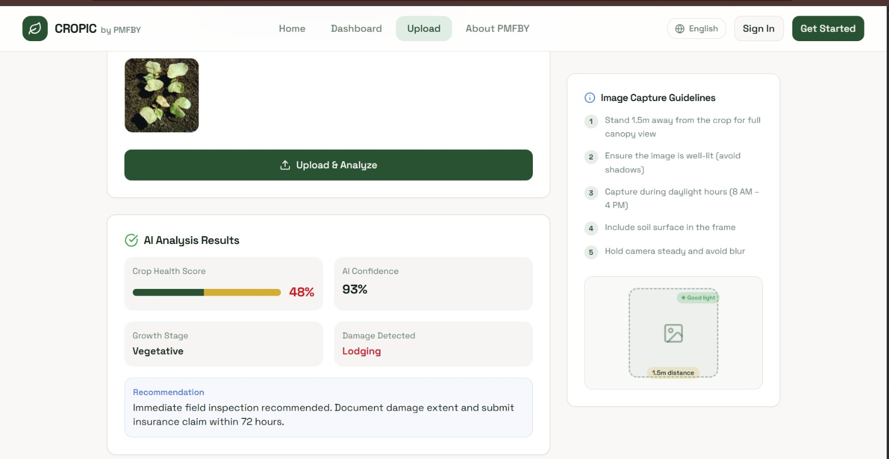

# CROPIC  
### AI-Powered Crop Damage Assessment & Claim Intelligence System

CROPIC (Collection of Real-Time Observations & Photo of Crops) is an AI-enabled crop monitoring and insurance verification system designed under the PMFBY ecosystem.

It streamlines crop-loss assessment using guided mobile capture, AI-based damage quantification, satellite NDVI validation, and fraud detection workflows — reducing delays, inconsistencies, and manual errors in claim processing.

---

## ✨ Features

- 📷 **Guided Field Capture** (Ghost Overlay + Blur Gate Validation)  
- 🤖 **AI-Based Damage Quantification** (Stress detection + segmentation models)  
- 🛰️ **Dual Verification Engine**
  - Ground-level crop stress analysis  
  - Satellite NDVI discrepancy scoring  
- 🔍 **Fraud Detection** (ELA tamper analysis + audit queue escalation)  
- 🌍 **Multilingual Voice Reporting** (11 language support)  
- 📊 **Insurer Command Dashboard**  
- ⚡ Load-tested backend (<2s p95 latency enforcement)  
- 🔁 Reproducible evaluation & TRL gate pipeline  

---

## 📸 Screenshots

### 📊 Dashboard Command Center


### 📷 Guided Image Upload


### 📈 AI Damage Analysis


---

## 🛠️ Tech Stack

### 📱 Mobile
- React Native
- Camera API (guided overlay + blur detection)

### 🖥️ Backend
- FastAPI
- Python
- Uvicorn
- PostgreSQL

### 🌐 Dashboard
- Next.js
- React

### 🧠 AI Services
- Crop stress classification models
- Segmentation models
- NDVI cross-verification templates
- ELA-based tamper detection

### 🛰️ Satellite Layer
- Sentinel-2 NDVI templates
- Pilot district datasets

### ⚙️ Infrastructure
- Docker Compose
- NGINX (TLS ingress support)

---

## 🧠 Architecture Overview

```text
Mobile App (React Native)
        |
        | REST APIs
        |
Backend (FastAPI)
        |
        | AI Services (Stress + Segmentation + Fraud)
        |
PostgreSQL Database
        |
Satellite NDVI Cross-Verification
        |
Dashboard (Next.js)
```

### System Flow

1. Farmer captures crop image via guided mobile app  
2. Metadata extracted and stored  
3. AI computes ground stress score  
4. NDVI satellite score retrieved  
5. Discrepancy scoring performed  
6. Fraud checks (ELA) executed  
7. Results pushed to insurer dashboard  
8. Escalation queue triggered if anomaly detected  

---

## 📂 Project Structure

```text
CROPIC/
│
├── mobile/                  # React Native field capture app
├── backend/                 # FastAPI backend APIs
├── dashboard/               # Next.js insurer dashboard
├── ai-services/             # Model utilities & tests
├── db/                      # PostgreSQL schema & migrations
├── satellite/               # Sentinel-2 NDVI templates
├── research/                # Persona research & interviews
├── infra/                   # Docker compose & NGINX
├── docs/execution/          # Load tests, runbooks, TRL gate
│
├── submission_package/      # Final submission-ready bundle
└── scripts/                 # Automation & evaluation scripts
```

---

## 🚀 Getting Started (Local Setup)

### 🔹 Backend Setup

```bash
cd backend
python -m venv .venv
.venv\Scripts\Activate.ps1
pip install -r requirements.txt
uvicorn app.main:app --reload --port 8000
```

Backend runs at:
```
http://localhost:8000
```

---

### 🔹 Local Infrastructure

```bash
cd infra
docker compose up -d
```

For TLS ingress setup:
```
https://localhost:8443
```

---

## 🔌 MVP API Endpoints

- `GET /health`
- `POST /v1/images/metadata`
- `POST /v1/claims`
- `POST /v1/verification/dual`
- `POST /v1/fraud/ela`
- `GET /v1/audit/queue`

---

## 🧪 Testing & Validation

### 🔹 Smoke Test

```bash
python scripts/smoke_backend_flow.py
```

---

### 🔹 Load Testing

```bash
python scripts/load_test_backend.py
python scripts/latency_gate.py
```

Full automation:

```bash
powershell -ExecutionPolicy Bypass -File scripts/run_all_checks.ps1
```

---

## 📊 Success Metric Evaluation

1. Fill evaluation CSVs:
   - `classification_eval.csv`
   - `segmentation_eval.csv`
   - `fraud_eval.csv`

2. Run:

```bash
python scripts/evaluate_success_metrics.py
python scripts/summarize_checks.py
python scripts/trl_gate.py
```

---

## 🛡️ Reliability & Governance

- Uptime Monitor → `uptime_monitor.py`
- Drift Detection → `drift_monitor.py`
- Incident Runbook → `incident_runbook.md`
- Model Governance → `model_governance.md`
- Compliance Checklist → `compliance_prep_checklist.md`

---

## 📦 Submission Package

- Upload-ready folder → `submission_package/`
- Upload-ready archive → `submission_package.zip`
- Architecture snapshot included  
- File manifest included  

---

## 🎯 Why This Project?

CROPIC addresses real-world challenges in agricultural insurance:

- Slow claim settlement cycles  
- Manual and inconsistent damage estimation  
- Fraudulent claim submissions  
- Lack of standardized field verification  

It combines AI, satellite intelligence, and governance workflows into a TRL 4/5 prototype ready for structured validation.

---

## 🌐 Project Link

https://r.listwr.me/cropwatch-ai  

---

## TEAMNAME: Code INTELLECTS
